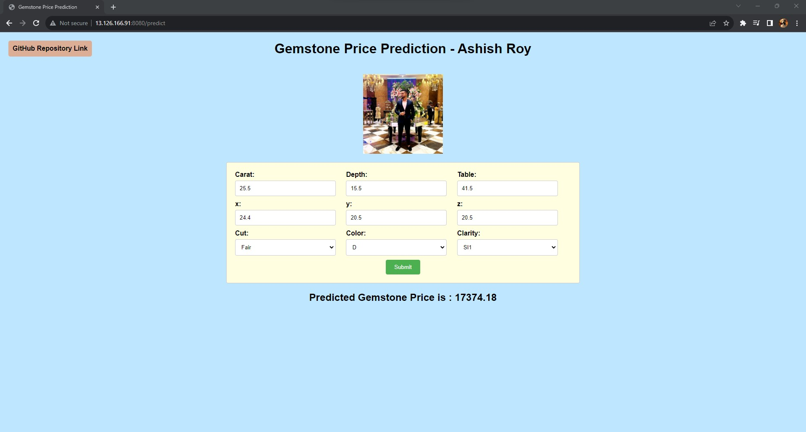
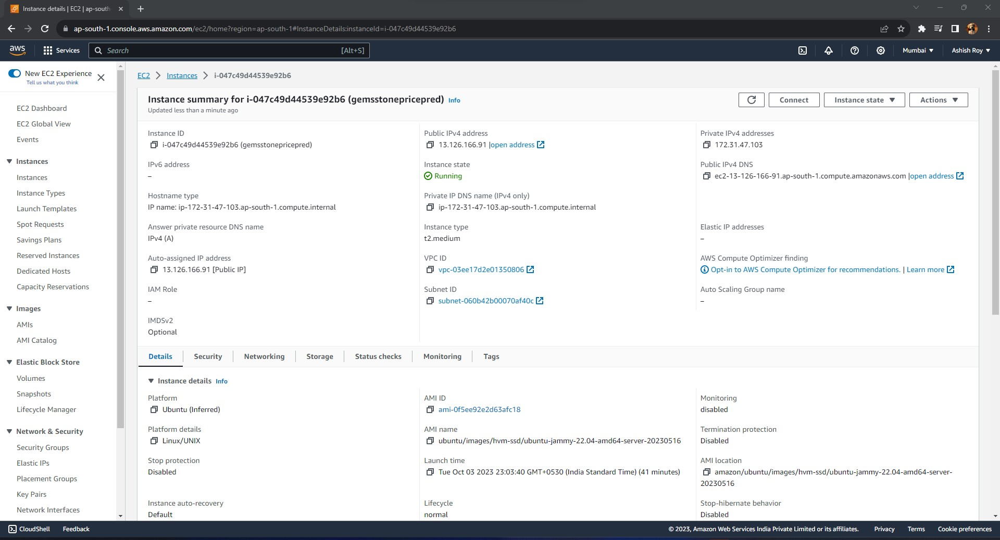
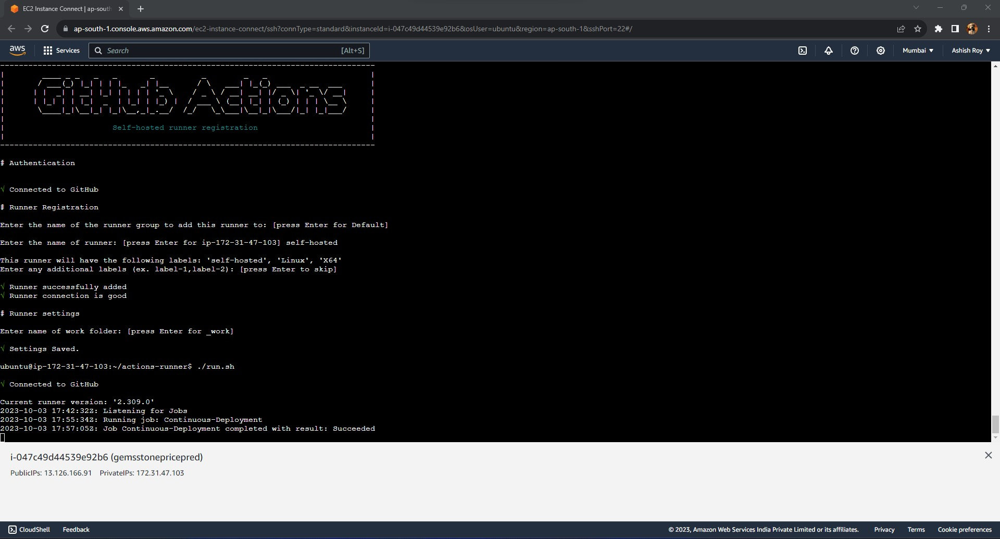
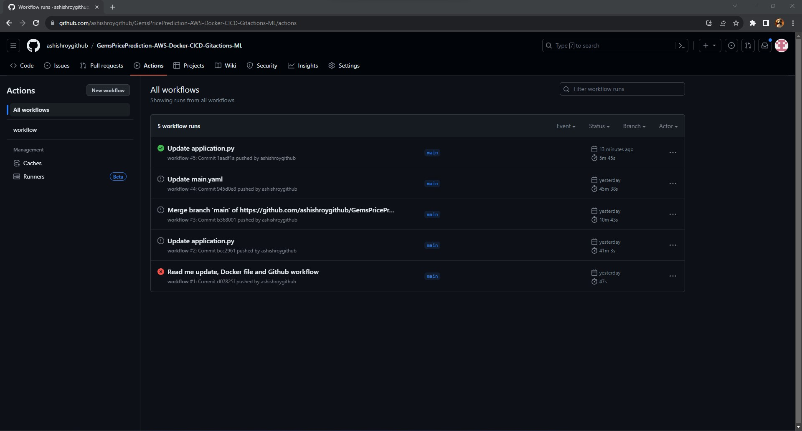
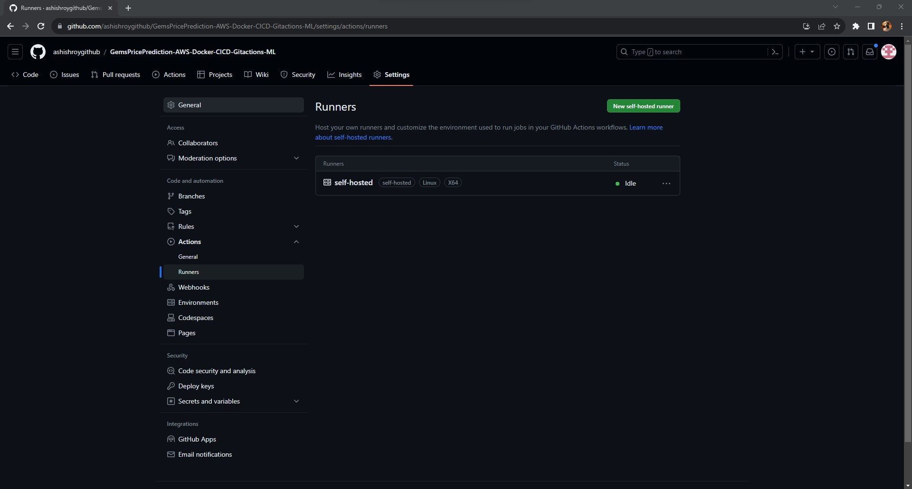
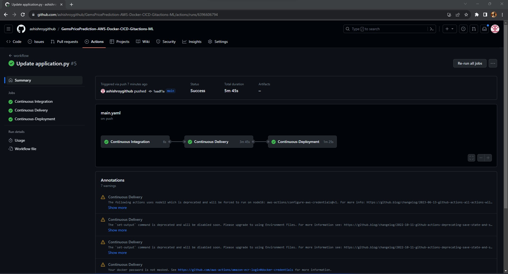
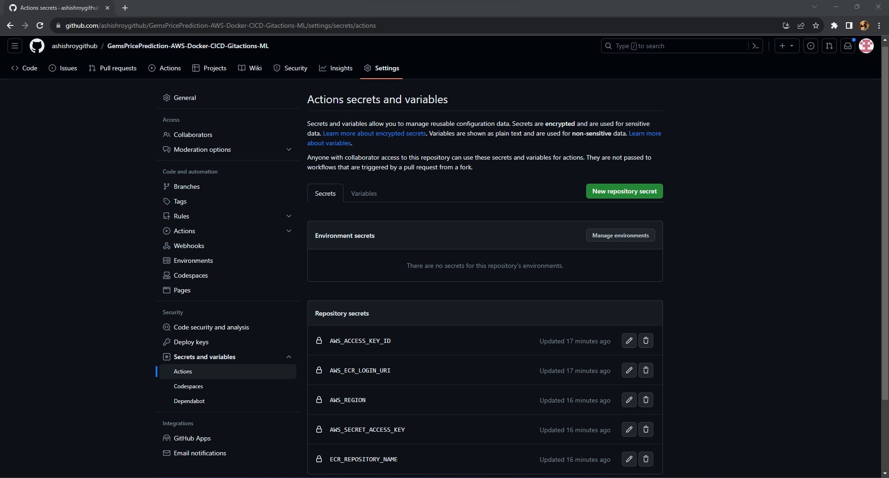

# Gemstone Price Prediction - Ashish Roy

##### PrereqiPrerequisites - GitHub, New Env, Setup file

**GitHub**

#### Step by step Implemenatation. - GitHub

* `Step 1` : Get your GitHub in sync with Visual Code.

* `Step 2` : Set up a virtual Environment: `conda create -p venv python==3.8 -y` (This will create a conda environment and install necessary libraries)

* `Step 3` : Activate the virtual environment: `conda activate venv/`

* `Step 4` : `Next process is to clone the entire repository so that we are able to commit our code.`
    * echo "# GemsPricePrediction-AWS-Docker-CICD-Gitactions-ML" >> README.md
    * git init
    * git add README.md
    * git commit -m "first commit"
    * git branch -M main
    * git remote add origin https://github.com/ashishroygithub/GemsPricePrediction-AWS-Docker-CICD-Gitactions-ML.git
    * git push -u origin main

* `Step 5` : `For Existing Repository:`
    * git remote add origin https://github.com/ashishroygithub/GemsPricePrediction-AWS-Docker-CICD-Gitactions-ML.git
    * git branch -M main
    * git push -u origin main

* `Step 6` : `You can use the below commands to add the new files which have been created on vs-code step by step`
    * git add . (This adds all the new file into the repository)
    * git status (you can use this to check the status of the command)
    * git commit -m "Comments" (you can use this to add the comments during push)
    * git push -u origin main (This is where you push the code to the github repository)
    * git pull (If you have made any changes into the github repository, this will help to pull the same)

#### Step by step Implemenatation. - GITBash

## If you have not installed GIT then go-ahead and install GITBash (This will help in cloning the repository which is present on VsCode with github)

*** IF you are initializing GIT for the first time and then you get an error of authorization : ***

* `Step 1` : Use your terminal and write these commands below :

    * git config --global user.email "ashishgithubprojects@gmail.com"
    * git config --global user.name "ashishroygithub"
    * git config --local user.name "ashishroygithub"
    * git status == This command will help in adding the environment.
    * after git remote add: you can use this function to check  “ git remote -v “
    * create a .gitignore file on the GitHub webpage (reason for creating it is that we can ignore certain files that doesn’t require to be commited) some of the common things.
    * “git pull” function is basically use to download all the files.

* `Step 2` : If you are getting permission denied response then you can use the below to solve the issue.

    * git remote set-url origin https://user_name@github.com/username/repository_name.git
 
* `Step 3` : Scenario : If you are creating a new folder with a different project and you want to create another new repository and clone another new local repository. What do you do?
     * git remote -v (here you need to check which repository is reflecting, if the old_repository is reflecting then go to the next step)
     * git remote set-url origin https://user_name@github.com/username/new_repository_name.git
     * git remote -v
     * git init
     * git remote add origin https://github.com/ashishroygithub/new_repository_name.git
     * git branch -M main
     * git push -u origin main
     * git status

##### MAPPING HAS BEEN COMPLETED.

##### Things to remember : `"requirements.txt"`

### Edit : when you are facing an issue of this : `Traceback (most recent call last): File "src/components/data_ingestion.py", line 3, in <module> from src.exception import CustomException ModuleNotFoundError: No module named 'src'` - * *Solution* * : "pip install -e ." inside the terminal.

* when you want to trigger "setup.py" inside the requirements.txt file then you mention "-e .", if not then you just # "-e ." when you are directly trying to run the setup.py file (This second one can be # when you are trying to deploy it on the cloud.)

* you can use `pip install -r requirements.txt` to run all the packages, but if you are using it on the deployment stage then make sure you hastag this #-e .

**Files Created:**

01. GemStonePricePrediction/`setup.py`
02. GemStonePricePrediction/`requirements.txt`
03. GemStonePricePrediction/`.gitignore`
04. GemStonePricePrediction/`README.md`
05. GemStonePricePrediction/src/`__init__.py`
06. GemStonePricePrediction/src/`exception.py`
07. GemStonePricePrediction/src/`logger.py`
08. GemStonePricePrediction/src/`utils.py`
09. GemStonePricePrediction/src/components/`__inti__.py`
10. GemStonePricePrediction/src/components/`data_ingestion.py`
11. GemStonePricePrediction/src/components/`data_transformation.py`
12. GemStonePricePrediction/src/components/`model_trainer.py`
13. GemStonePricePrediction/src/pipeline/`__init__.py`
14. GemStonePricePrediction/src/pipeline/`predict_pipeline.py`
15. GemStonePricePrediction/src/pipeline/`train_pipeline.py`

### Introduction About the Data :

**The dataset** The goal is to predict `price` of given diamond (Regression Analysis).

There are 10 independent variables (including `id`):

* `id` : unique identifier of each diamond
* `carat` : Carat (ct.) refers to the unique unit of weight measurement used exclusively to weigh gemstones and diamonds.
* `cut` : Quality of Diamond Cut
* `color` : Color of Diamond
* `clarity` : Diamond clarity is a measure of the purity and rarity of the stone, graded by the visibility of these characteristics under 10-power magnification.
* `depth` : The depth of diamond is its height (in millimeters) measured from the culet (bottom tip) to the table (flat, top surface)
* `table` : A diamond's table is the facet which can be seen when the stone is viewed face up.
* `x` : Diamond X dimension
* `y` : Diamond Y dimension
* `x` : Diamond Z dimension

Target variable:
* `price`: Price of the given Diamond.

Dataset Source Link :
[https://www.kaggle.com/competitions/playground-series-s3e8/data?select=train.csv](https://www.kaggle.com/competitions/playground-series-s3e8/data?select=train.csv)

### It is observed that the categorical variables 'cut', 'color' and 'clarity' are ordinal in nature

### Check this link for details : [American Gem Society](https://www.americangemsociety.org/ags-diamond-grading-system/)

### ALWAYS Run "pip install -e ." this will trigger the setup file. 

##### DEPLOYMENT - AWS - DOCKER - GIT ACTIONS - AWS (Elastic Container Storage)

* `Step 1` : Here we will be building the deployment using EC2 Insatance and Elastic Container Registry
  
    * First we need to create a Docker file.

        * `FROM python:3.8-slim-buster`  # This will help us to fetch the base image from docker hub which is already present.
        * `WORKDIR /app` # This will help in creating a working directory from where the code needs to be run when creating an image on top of the base image.
        * `COPY . /app` # This will help in copying all the files from the local to the app folder for which the base image is going to be created on docker
        * `RUN apt update -y && apt install awscli -y` # This command will help us in updating all the packages before we deploy and also it will install the Amazon Web Services Command Line Interface
        * `RUN pip install -r requirements.txt` # This command will help us in updating all the dependencies and requirement.
        * `CMD ["python3", "app.py"]` # This is the command which will be used to run the app.py file, and python3 will help the interface to understand that we are running it on python 3.8 version.

    * Now we need to check if the build happens or not (in the command prompt type as below)
        - first open docker desktop
        - `docker images` # This will help to show what are all the images that are present.
        - `docker build -t ashishroy29/gemspricepred-app .` # This will help to build a image for the same
        - `docker run -p 8080:8080 ashishroy29/gemspricepred-app` # This command will help us to set 2 important info host port and container port which is crucial to connect to the web or even to run the application.
        - `docker push ashishroy29/gemspricepred-app:latest` # This will help to push the latest image into repository with that latest tag, latest is nothing but the tag, which you can go to the docker hub and find it.
        - `docker image rm -f ashishroy29/gemspricepred-app` # This will help remove the image from the container
        

* `Step 2` : We will be creating a ***Github actions workflow*** which will help in deploying the same onto the ECR and then to EC2 instance.

    * Creating `main.yaml` file.
        - This is where the entire workflow deployment will happen and this is the file where the Entire CI/CD (Continous Integration and Continous Deployment process takes place)
        - whenever there is a push happening on the main branch, this gets triggered and the workflow starts (3 steps takes place here)
        - jobs > integration > build-and-push-ecr-image > finally Contionous-Deployment. (these steps are important)
        - Ecr is a private repository in AWS, unlike docker hub where you can allow anyone to download the image. (ECR is majorly used by organisations)
        - ECR - Elastic Container Repository - Fully-Managed Docker container to store, Manage and deploy Images.
        - Docker Image > Pushed to ECR > Pushed to EC2 Instance.
        - `Integration Steps` : Eg : Continous Integration > runs on Ubuntu-Latest (can be any OS) > Checks out code > Lints Repository > Run Unit Tests.
        - `build-and-push-ecr-image` : Eg : Contionus Delivery > Needs step of Integration to run successfully > check code from github > isntall libraries/Update packages > configure aws credentials > accesskey/secretaccesskey > login to ECR from the credentials > build tag and push image to ECR. (needs output registry and Repository name)
        - `Continous Deployment`: Eg : build-and-push-ecr-image > this image will run as self-hosted app runner after giving certain permissions > credentials > login to ecr >
        pull the latest image > do the deployement in the ec2 instance in port 8080.

    * How to generate `main.yaml` file.
        - Go to your Github Account
        - Click on the repository you are creating your project on
        - Click on Actions
        - Click on New Workflow
        - Click on Deploy to Amazon ECS
        - Click on Configure
        - Now change the github actions yaml file accoding to the CI/CD Pipelines.
        - copy the code and paste it over here, first create a folder ".github" and a folder inside that "workflows" and then create "main.yaml"

* `Step 3` : We will be setting up a ***AWS IAM user account for self-hosted app service*** which will help in deploying the same onto the ECR and then to EC2 instance using the credentials.

    * Creating `IAM user` in AWS.
        - go to console aws.com
        - login with root user.
        - Click on IAM in search bar (Identity and Access Management)
        - IAM is basically used to give the permission to self-deploy the application using CI/CD.
        - Click on Create User (ashishroycicd) > Next
        - Click on Attach Policies Directly > search for "AmazonEC2ContainerRegistryFullAccess" > Add this policy.
        - search for another policy "AmazonEC2FullAccess" > Add this policy > Next
        - Click Create User

    * After Creating user
        - search > IAM > ashishroycicd > Security credentials
        - Create Access key
        - Command Line Interface > Next
        - Create access key
        - download the csv
        - Done

    * Search for ECR
        - Create Repository
        - Private
        - Repository name = gemsstonepricepred
        - Create the repository.
        - Copy the URI/URI
        - 049693961480.dkr.ecr.ap-south-1.amazonaws.com/gemsstonepricepred
        
    * search for EC2 Instance
        - Launch an Instance
        - give name to the web app
        - click on ubuntu OS > 64-bit
        - click on the medium requirements and then later delete the instance
        - click on keypair select required
        - Create security group, All everything - SSH, HTTPS, HTTP traffic.
        - Launch Instance

    * After the instance is launched
        - click on Instance ID.
        - click on connect on top
        - EC2 Instance Connect > Click on Connect
    
    * Setup Docker in EC2
        - `clear` (To clear screen)
        - `sudo apt-get update -y` (to get update on all the packages and indexed properly)
        - `sudo apt-get upgrade` (just setting up server)
        - `curl -fsSL https://get.docker.com -o get-docker.sh` (installing all the Docker packages setups in regards to docker)
        - `sudo sh get-docker.sh` (all admin access is provided)
        - `sudo usermod -aG docker ubuntu` (so that we dont have to write sudo all the time we write command)
        - `newgrp docker` creating a new group called as docker.

    * Checking if docker is running:
        - type docker in awscli
        - docker image > ECR > installed in EC2 instance (These are steps of Execution)

* `Step 4` : We will be setting up a ***GITHUB Runner*** which will help in deploying when there is a code commit in the main repository (Automatically)
    
    * Github Runners Setup
        - Go to your repo on github > settings > actions > Runners
        - Click New self-hosted runner
        - Linux
        - You will find a list of commands over there
        - Execute the line of codes in Aws CLI
        - Just press enter for default runner group after running all the commands.
        - runner name : self-hosted
        - no extra labels, just press enter
        - just press enter for work folder
        - now after all the details click on run.sh
        - now you can see in github actions and in runners, there is an App runner created with the name self-hosted which would be in an idle state

* `Step 5` : We will be setting up a ***GITHUB Secret Keys for the jobs or the runner to work*** which will help in authentication.

    * Setting up AWS keys for the self-hosted app service on github.

        - Go to the Repository you are workin on.
        - Click on settings
        - Click on Secrets and variables > Click on Actions
        - Delete all the previous keys if present
        - Now we need to add 5 things: > Add New repository secrets
            `AWS_ACCESS_KEY_ID` (This you can find inside the csv file which was downloaded)
            `AWS_SECRET_ACCESS_KEY` (This you can find inside the csv fike which was downloaded)
            `AWS_REGION` (This you can find in the aws console "ap-south-1" this depends)
            `AWS_ECR_LOGIN_URI` (This you can find inside the instance of ECR which you created earlier)
            `ECR_REPOSITORY_NAME` (you need to give the name of the repository which got created during the ECR creation)

* `Step 6` : Now we will have to all the network access to the ***Network port*** which has been mentioned (In our case it is 8080)
    
    * Step by step Allowing access

        - Go to console.aws
        - Search for EC2 instance
        - click on the instance ID of the instance you want to choose
        - Click on the security
        - Click on security groups
        - edit inbound rules
        - add new inbound rule
        - Type - Custom TCP
        - Protocol - TCP
        - Port Range - 8080 (this is the port which is mentioned in the app port/ host port / container port)
        - source type - Anywhere-IPv4
        - source - 0.0.0.0/0
        - Now copy the Public IPv4 address 13.126.166.91
        - Along with that add the port number 8080
        - Eg : 13.126.166.91:8080
        - This should start working now 

# AWS - Github Workflow - Docker CI/CD - Deployment Link :

AWS - Github Workflow - Docker CI/CD link : [http://13.126.166.91:8080/predict](http://13.126.166.91:8080/predict)

# Screenshot of UI

# Postman Testing of API :

# AWS EC2 Instance Web App Summary

# AWS-CLI-Interface

# GithubActionsWorkflowPage

# GithubRunnersInterface

# GithubWorkflowDeploymentSummary

# SecretsandVariablesSummary

# Approach for the project 

1. Data Ingestion : 
    * In Data Ingestion phase the data is first read as csv. 
    * Then the data is split into training and testing and saved as csv file.

2. Data Transformation : 
    * In this phase a ColumnTransformer Pipeline is created.
    * for Numeric Variables first SimpleImputer is applied with strategy median , then Standard Scaling is performed on numeric data.
    * for Categorical Variables SimpleImputer is applied with most frequent strategy, then ordinal encoding performed , after this data is scaled with Standard Scaler.
    * This preprocessor is saved as pickle file.

3. Model Training : 
    * In this phase base model is tested . The best model found was catboost regressor.
    * After this hyperparameter tuning is performed on catboost and knn model.
    * A final VotingRegressor is created which will combine prediction of catboost, xgboost and knn models.
    * This model is saved as pickle file.

4. Prediction Pipeline : 
    * This pipeline converts given data into dataframe and has various functions to load pickle files and predict the final results in python.

5. Flask App creation : 
    * Flask app is created with User Interface to predict the gemstone prices inside a Web Application.

# Exploratory Data Analysis Notebook

Link : [EDA Notebook](./notebook/1_EDA_Gemstone_price.ipynb)

# Model Training Approach Notebook

Link : [Model Training Notebook](./notebook/2_Model_Training_Gemstone.ipynb)

# Model Interpretation with LIME 

Link : [LIME Interpretation](./notebook/3_Explainability_with_LIME.ipynb)
